# README

# AIFFEL Campus Online Code Peer Review Templete

- 코더 : 오학균
- 리뷰어 : 임보혁

# PRT(Peer Review Template)

- [ ] **1. 주어진 문제를 해결하는 완성된 코드가 제출되었나요?**
- KITTI 데이터셋에 대한 분석이 체계적으로 진행되었다.
  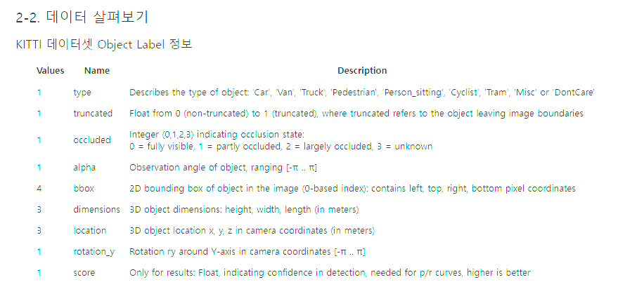
  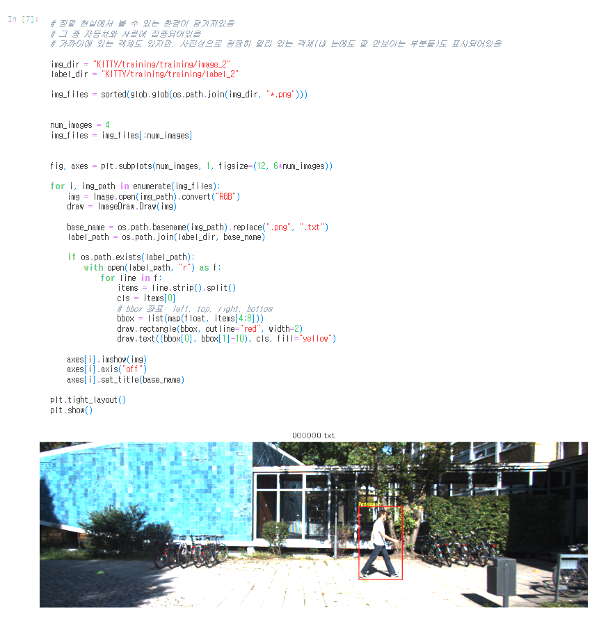
  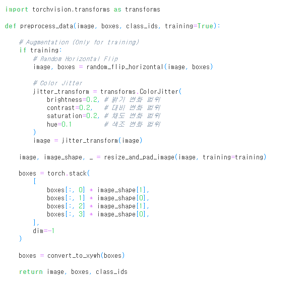
- RetinaNet 학습이 정상적으로 진행되었지만, 바운딩박스가 정확히 표시되지 않았다.

  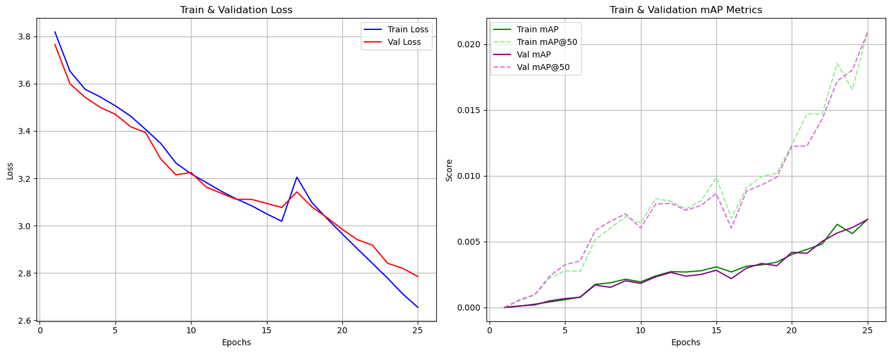

  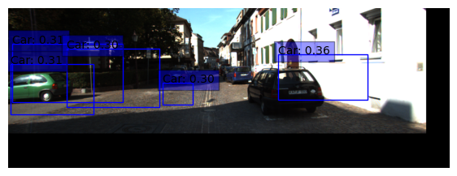

- 자율주행 Object Detection 테스트시스템 적용결과
  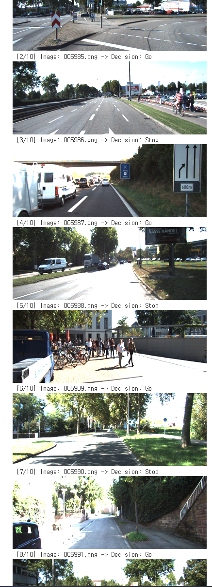
  자율주행 테스트 시스템을 완성하였다.
- [x] **2. 전체 코드에서 가장 핵심적이거나 가장 복잡하고 이해하기 어려운 부분에 작성된
      주석 또는 doc string을 보고 해당 코드가 잘 이해되었나요?** - 주석이 잘 작성되어있습니다.
          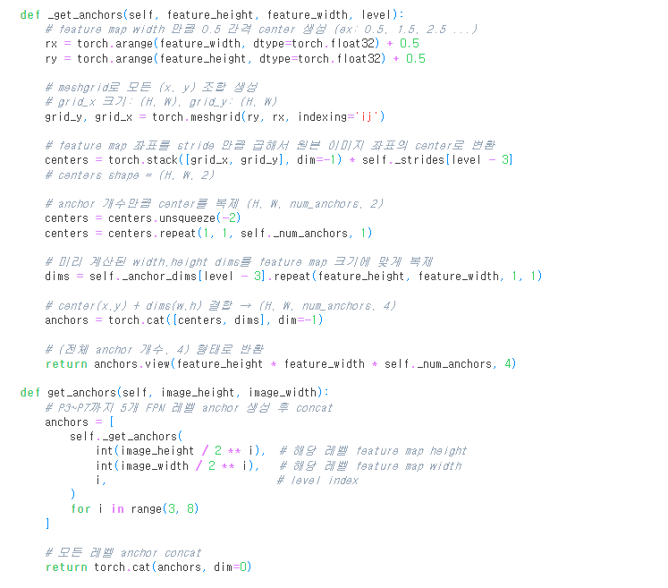

- [x] **3. 에러가 난 부분을 디버깅하여 문제를 해결한 기록을 남겼거나
      새로운 시도 또는 추가 실험을 수행해봤나요?**
      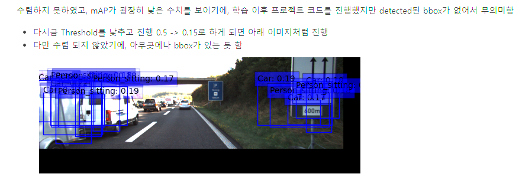

      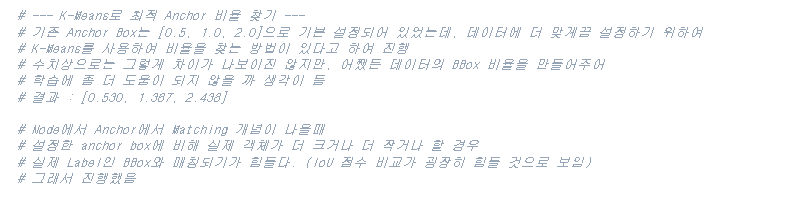

      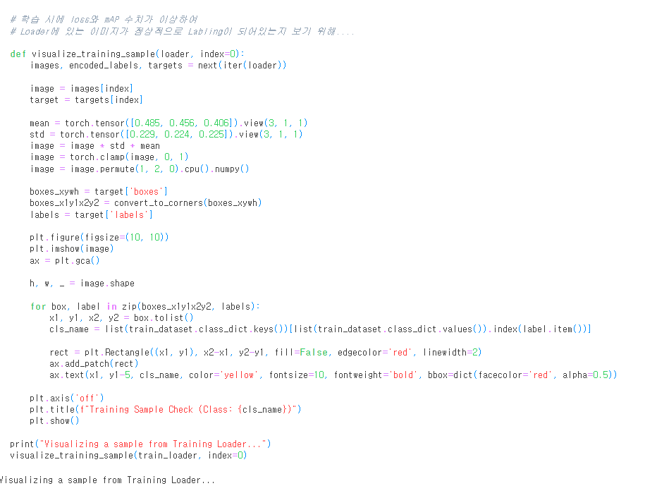

      - 최적의 앵커비율을 찾기 위한 탐색, mAP가 이상하게 낮은 것을 디버깅하기 위한 코드
- [x] **4. 회고를 잘 작성했나요?**
  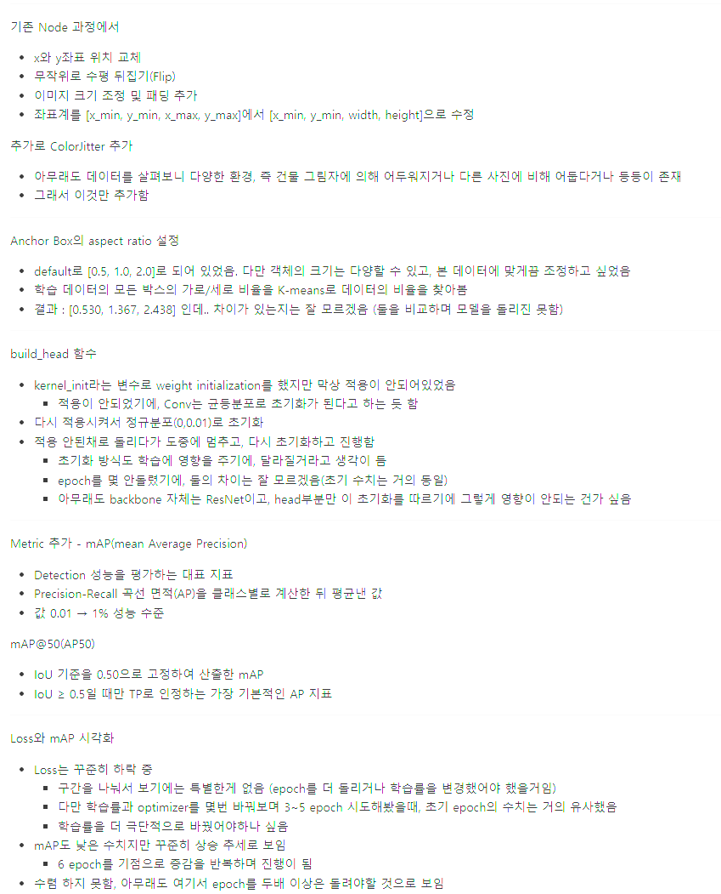
  - 회고가 잘 작성되었습니다.
- [x] **5. 코드가 간결하고 효율적인가요?**
  - 모두 만족하였습니다.

# 회고(참고 링크 및 코드 개선)

```
제한된 컴퓨팅 리소스를 극복하기 위해 많은 노력을 하신 것 같습니다.
모델의 성능을 높히기 위해 anchor box의 aspect ratio를 k-means로 찾은 부분이 인상적이었습니다.
```
