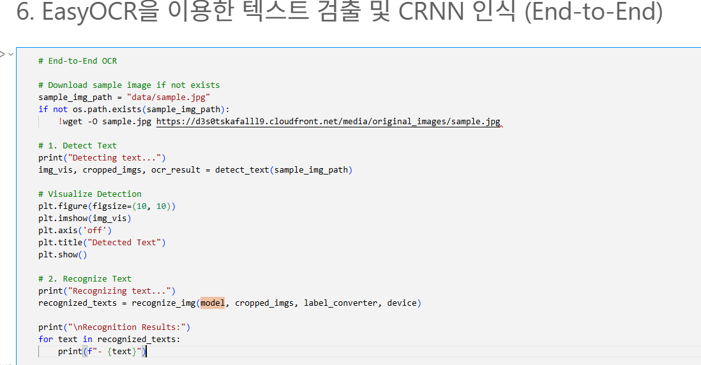
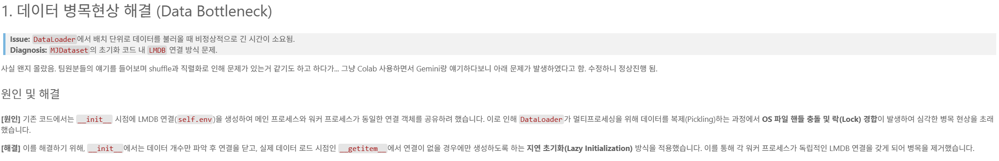
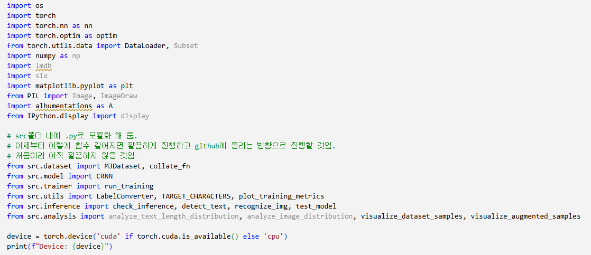

# AIFFEL Campus Online Code Peer Review Templete

- 코더 : 코더의 이름을 작성하세요.
- 리뷰어 : 리뷰어의 이름을 작성하세요.

# PRT(Peer Review Template)

- [v] **1. 주어진 문제를 해결하는 완성된 코드가 제출되었나요?**
  - 문제에서 요구하는 최종 결과물이 첨부되었는지 확인
    
- [v] **2. 전체 코드에서 가장 핵심적이거나 가장 복잡하고 이해하기 어려운 부분에 작성된
      주석 또는 doc string을 보고 해당 코드가 잘 이해되었나요?** 
    
- [v] **3. 에러가 난 부분을 디버깅하여 문제를 해결한 기록을 남겼거나
      새로운 시도 또는 추가 실험을 수행해봤나요?** 
      
- [v] **4. 회고를 잘 작성했나요?**
    
    
    
- [v] **5. 코드가 간결하고 효율적인가요?**
    

# 회고(참고 링크 및 코드 개선)

```
코드 스타일이 매우 깔끔하게 정리되어 있어 읽기 매우 좋음
이와 더불어 많은 횟수의 실험을 진행한것이 회고록을 여러차례로 나누어 작성한 것으로 알 수 있었고
각 회고 차수마다 표로 정리하여 실험 진행과정을 상세히 기록하였음
코드, 회고의 정석을 보여준다 라고 생각할 정도로 체계적으로 정리되어있음
```
