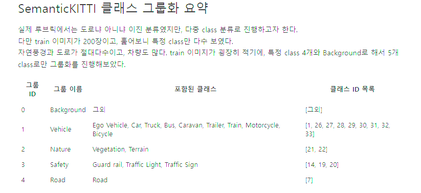
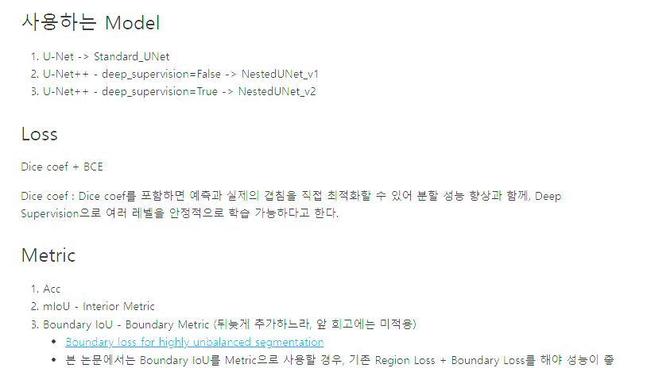
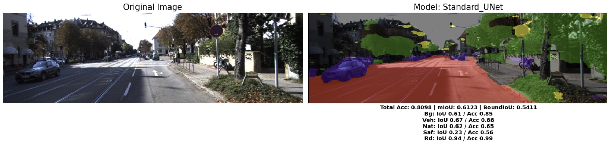
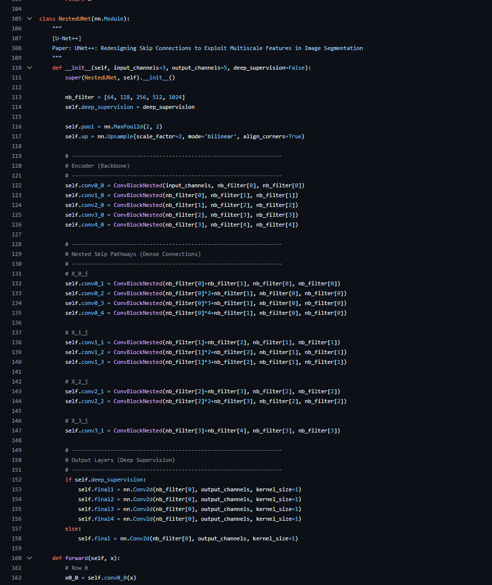
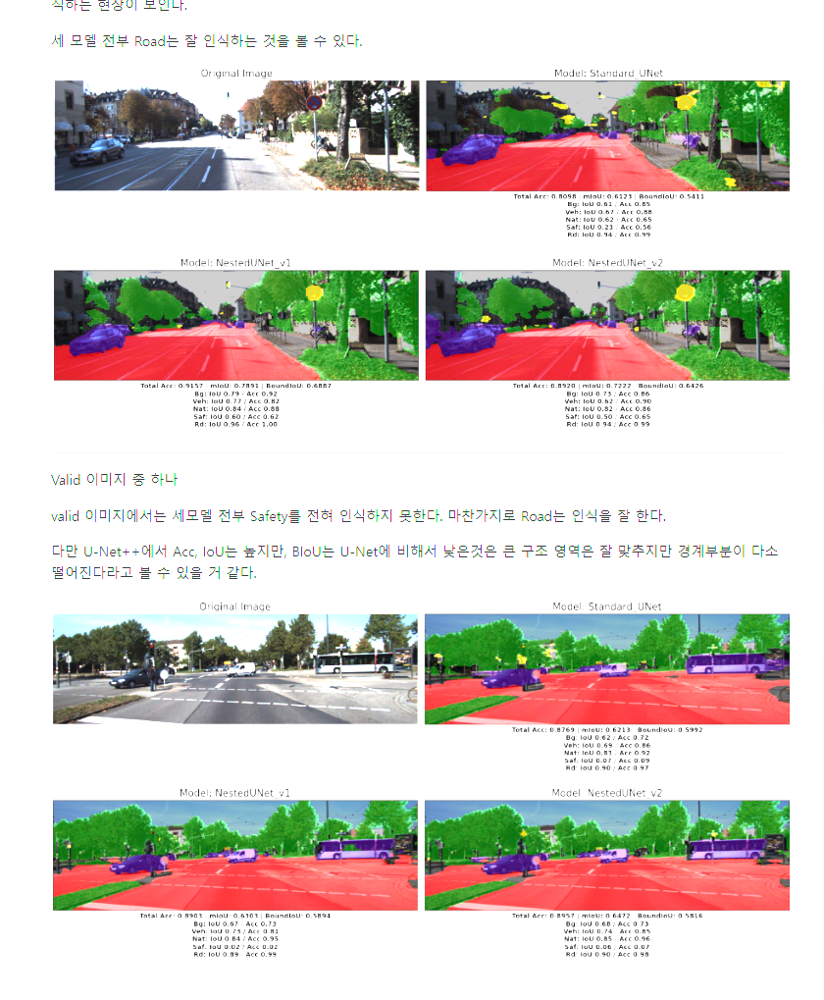
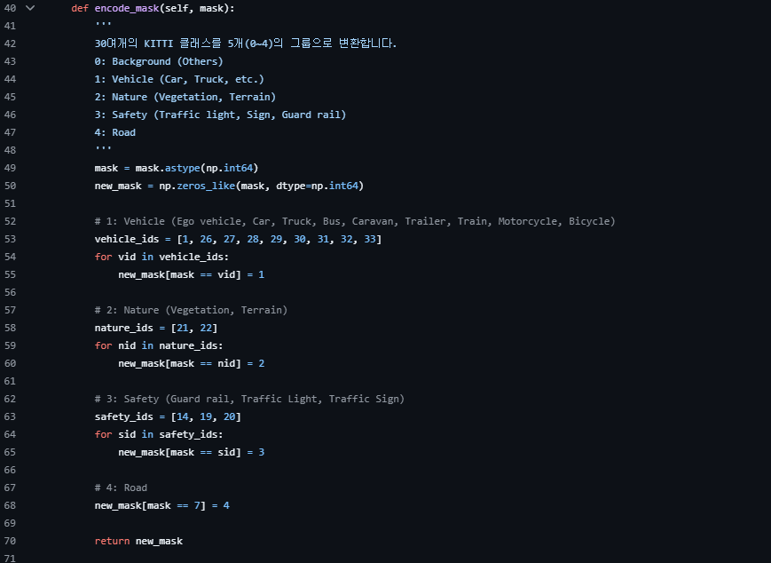
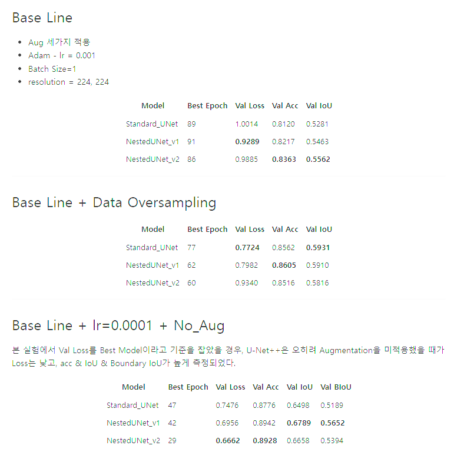

# README

# AIFFEL Campus Online Code Peer Review Templete

- 코더 : 오학균
- 리뷰어 : 임보혁

# PRT(Peer Review Template)

- [x] **1. 주어진 문제를 해결하는 완성된 코드가 제출되었나요?**
  - 문제에서 요구하는 최종 결과물이 첨부되었는지 확인
    - KITTI 데이터셋 구성, U-Net 모델 훈련, 결과물 시각화의 한 사이클이 정상 수행되어 세그멘테이션 결과 이미지를 제출하였습니다.
      
      
      
  - U-Net++ 모델을 스스로 구현하여 학습 진행 후 세그멘테이션 결과까지 정상 진행되었습니다.
    
  - U-Net과 U-Net++ 두 모델의 성능이 정량적/정성적으로 잘 비교되었습니다.
    
- [x] **2. 전체 코드에서 가장 핵심적이거나 가장 복잡하고 이해하기 어려운 부분에 작성된
      주석 또는 doc string을 보고 해당 코드가 잘 이해되었나요?** - 주석을 잘 달아 주셨습니다.
          

- [x] **3. 에러가 난 부분을 디버깅하여 문제를 해결한 기록을 남겼거나
      새로운 시도 또는 추가 실험을 수행해봤나요?**




- 메모리 절약을 위한 시도, fp32, fp16을 섞어쓰는 방식
- [x] **4. 회고를 잘 작성했나요?**
  
  - 사진 하단에 회고가 잘 작성되어있습니다.
- [x] **5. 코드가 간결하고 효율적인가요?**
- PEP8을 준수하였고, 모듈화가 잘되어 있어 알아보기 좋습니다.

# 회고(참고 링크 및 코드 개선)

```
Learning Rate와 Augmentation과 Oversampling으로만 조합을 섞어 다양한 시도
Best Epoch과의 비교를 통해  pair comparison
적은 데이터를 극복하기 위한 over sampling
이 인상 깊었습니다.
```
