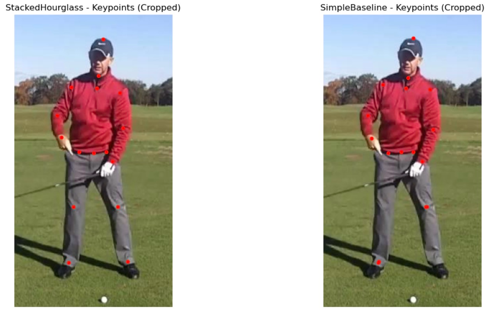
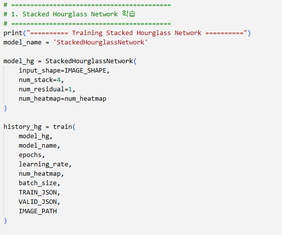
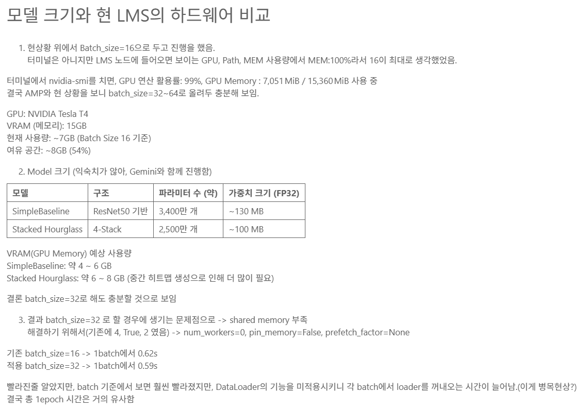
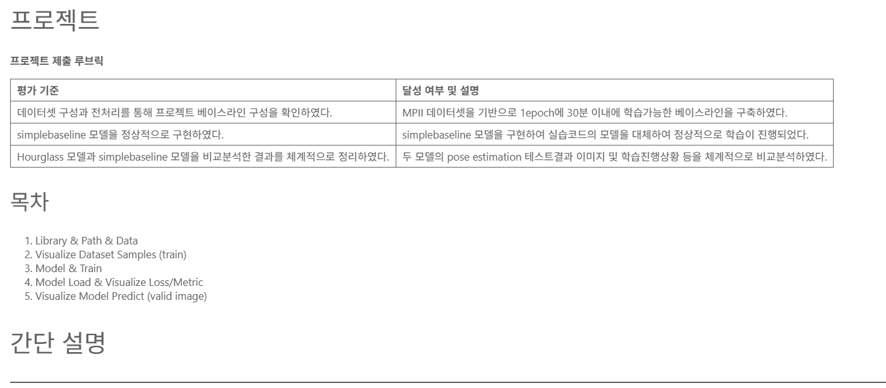
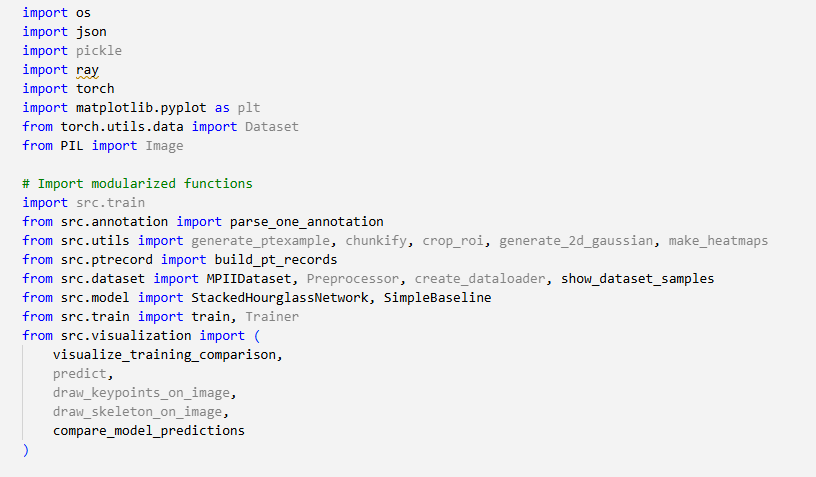

# AIFFEL Campus Online Code Peer Review Templete

- 코더 : 오학균
- 리뷰어 : 이상진

# PRT(Peer Review Template)

- [V] **1. 주어진 문제를 해결하는 완성된 코드가 제출되었나요?**

  

- [V] **2. 전체 코드에서 가장 핵심적이거나 가장 복잡하고 이해하기 어려운 부분에 작성된

  

- [V] **3. 에러가 난 부분을 디버깅하여 문제를 해결한 기록을 남겼거나

  배치 사이즈를 실험한 기록이 남아있음
  

- [V] **4. 회고를 잘 작성했나요?**
  
  회고에 목차가 도입되어 잘 작성되어 있음
  

- [V] **5. 코드가 간결하고 효율적인가요?**
  
  모듈화가 매우 잘 수행되어있음
  


# 회고(참고 링크 및 코드 개선)

```
깔끔하게 코드가 정리되어 있고 이에따른 회고도 목차를 도입해 잘 정리되어 있음
또한 이번 퀘스트 도입에서 이야기 하였던 하드웨어 성능에 대한 이야기도 서술되어 있음
매우 잘 작성된 퀘스트 라고 생각함
```
